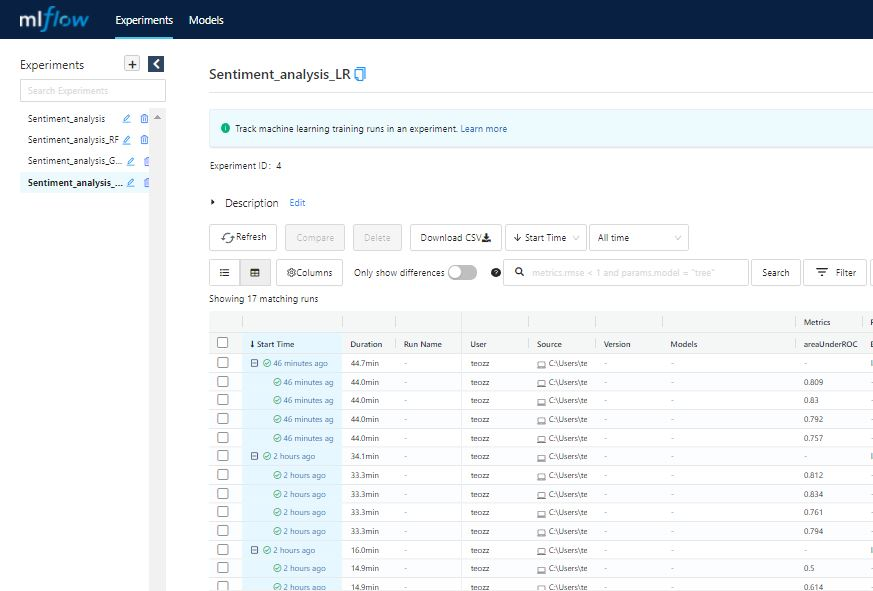
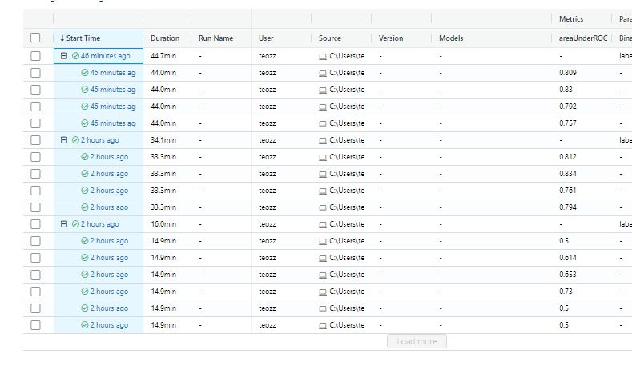

## Sentiment Analysis using Pyspark
In this repository, I will be using performing sentitment analysis using pyspark. The result will be tracked using mlflow using different algorithms like Logistic Regression and RandomForest. The best result achieved is 0.83 AUROC. Pretty good!

## Data
- I will be using Sentiment140 from standford http://help.sentiment140.com/for-students/
- I have reduced the size by 8 times to reduce the training time

## Data preparation
- pyspark inbuild pipeline 

## Model training
- pyspark inbuild crossvalidation
- pyspark inbuild gridsearch
- pyspark inbuild machine learning models

## Model Tracking
- MLFLOW

